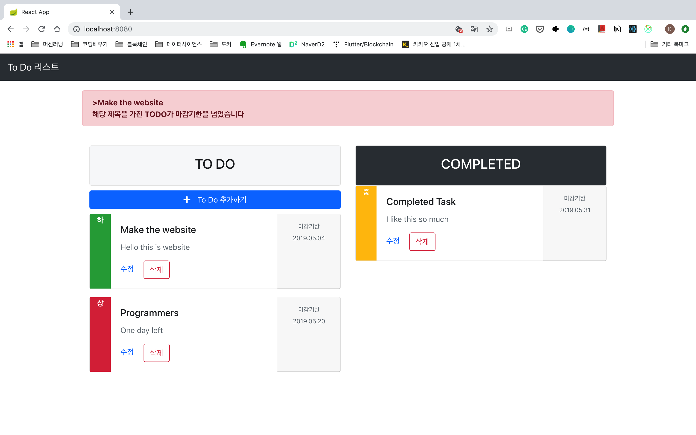
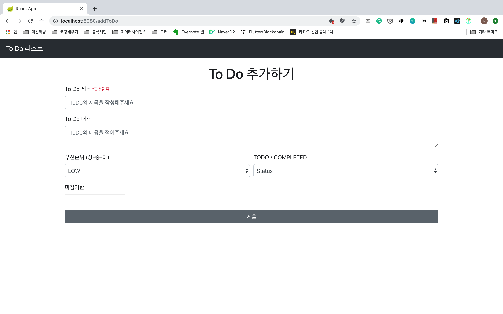

# Springboot & React - ToDoList

해당 프로그램을 확인할 수 있는 주소는 다음과 같습니다:
https://springboot-react-app.herokuapp.com/

## Build Local

git clone을 한후에 해당 폴더에 들어가서 로컬서버를 실행시키면 로컬에서 웹프로그램을 확인할 수 있습니다.
``` 
$ git clone https://github.com/dojinkimm/springboot-react

$ cd springboot-react

$ mvn spring-boot:run
```

그러고 나서 웹브라우저에 http://localhost:8080 을 작성하시면 해당 프로그램을 로컬 서버에서도 작동시킬 수 있습니다.


### Main Page
> ToDo 전체 리스트를 볼 수 있고 ToDo인데 마감기간이 지났으면 알림 문구가 나옵니다.




### Add To Do
> To Do를 추가할 수 있는 페이지입니다. 제목, 내용, 우선순위, 진행중 혹은 완료했는지, 마감기한을 설정할 수 있습니다.
 


